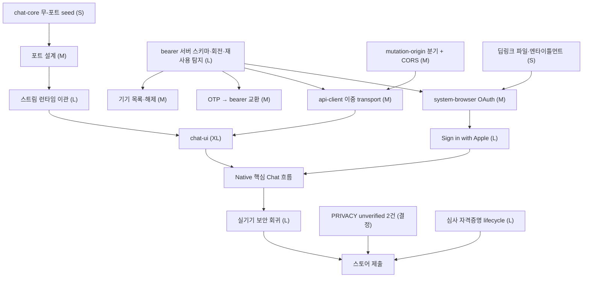

# iOS·Android Native 앱 준비도 스파이크 (2026-08-30)

- 대상: `mposition/Tomverse` `develop` @ `96f012b`
- 목적: 스토어 출시 앱 구현이 아니라, **Capacitor 로컬 번들 Native 앱으로 전환할 준비가 어디까지 되어 있는지**를 코드와 실행 증거로 확인하고 작업량을 산정하는 것
- 근거 문서: `docs/policy/tomverse-chat-delivery-plan.md`, `docs/policy/shared-packages.md`,
  `docs/policy/tomverse-chat-mobile-authentication.md`, `docs/policy/chat-concurrency-and-identity.md`,
  `docs/ops/tomverse-chat-store-review.md`, `docs/release-gates/tomverse-chat-v1.yaml`
- 플랫폼 사양 근거: Capacitor 8.5.0 배포 패키지 자체(`@capacitor/cli`·`ios`·`android`),
  `developer.apple.com`, `developer.android.com`. 블로그·요약·3자 집계는 근거로 쓰지 않았습니다.

> **이 문서가 주장하지 않는 것.** 실행한 검증은 §11에 전부 나열했습니다. iOS 빌드,
> 실기기 동작, Android Gradle 빌드는 **하나도 실행하지 않았고 통과로 기록하지 않았습니다.**
> 이 컨테이너는 Linux이고 Xcode도 Android SDK도 없습니다.

---

## 0. 한 문단 요약

플랫폼과 서버는 준비돼 있고, **클라이언트 경계가 준비돼 있지 않습니다.** 라우팅·크레딧·
첨부·생성 파일·계정 삭제·데이터 내보내기 같은 서버 계약은 이미 성숙해서 Native가 그대로
씁니다. 반면 Native가 **자기를 증명하는 방법**(bearer token, device family, CORS,
딥링크)은 스키마에 행 하나 없이 전부 M0이고, **화면을 그리는 코드**(`chat-ui`,
`api-client`)도 존재하지 않습니다. 그 사이에서 오늘 확인된 가장 구체적인 사실은
`lib/requestOrigin.ts`가 Capacitor의 두 origin 중 어느 것도 받지 않아 **Native의 모든
비-GET 요청이 라우트에 닿기 전에 421로 거절된다**는 것입니다(§3.1).

---

## 1. 기능별 성숙도 M0~M5

척도: **M0** 없음 · **M1** 결정만 있음(문서) · **M2** 부분 구현 · **M3** 구현됨(웹 기준)
· **M4** Native 경로까지 구현·검증 · **M5** 실기기 증거로 게이트 통과

| # | 영역 | 성숙도 | 근거 |
|---|---|---|---|
| 1 | 서버 chat 오케스트레이션·스트리밍 | **M3** | `app/api/chat/route.ts` 5,213줄, keepalive·idle timeout·취소·정산 전 경로 존재 |
| 2 | 동시 실행·admission·rate limit | **M3** | `lib/chatConcurrencyCore.ts`·`chatAdmissionCore.ts`, all-or-nothing preflight |
| 3 | 크레딧 예약·정산·guardrail | **M3** | `docs/policy/credit-and-cost-limits.md` 계약이 코드로 강제됨 |
| 4 | 계정 데이터 내보내기 | **M3** | `lib/accountDataExport*.ts`, 단발성 티켓·step-up·감사 |
| 5 | 인앱 계정 삭제 | **M3** | `app/api/user/account/route.ts` DELETE + `AuthButton.tsx` 확인 문구 |
| 6 | data-domain registry | **M2** | 55 도메인 등록, **2개가 `unverified`** (§3.4) |
| 7 | 공유 package (`chat-core`·`ui-tokens`) | **M3** | PACKAGE-01 approved. 단 범위는 이 두 개까지 |
| 8 | 모바일 웹 레이아웃 (`MobileChatShell`) | **M3** | 1,579줄, 3개 UI 계약이 회귀를 고정 |
| 9 | OAuth2 + PKCE 클라이언트 | **M2** | `lib/oauthLink.ts`가 이미 자체 PKCE 구현 — **재사용 가능** |
| 10 | 이메일 OTP·매직링크 | **M3**(웹) / **M0**(bearer 교환) | `lib/emailLogin.ts`는 쿠키만 발급 |
| 11 | `chat-ui` package | **M0** | 트리에 없음 |
| 12 | `api-client` package | **M0** | 트리에 없음 |
| 13 | `apps/mobile` 셸 | **M1→M2** | 이번 스파이크로 최소 scaffold 생성(§11) |
| 14 | mobile bearer token lifecycle | **M0** | Prisma 113개 model 중 refresh/device 관련 **0개** |
| 15 | refresh 회전·재사용 탐지·token family | **M0** | 코드·스키마 어디에도 없음 |
| 16 | 기기 목록·기기별 해제 | **M0** | `sessionRevocationCore.ts`는 계정 전체 revocation만 |
| 17 | explicit CORS allowlist | **M0** | `Access-Control-Allow-Origin` 문자열이 저장소에 **0건** |
| 18 | Sign in with Apple | **M0** | provider는 Google·AzureAD·Credentials 셋뿐 |
| 19 | Universal Link / App Link | **M0** | `public/.well-known/`에 microsoft 파일 1개뿐 |
| 20 | 스토어 심사 자격증명 lifecycle | **M1** | `docs/ops/tomverse-chat-store-review.md`는 완성, 구현 0 |
| 21 | 백그라운드·포그라운드 전환 | **M0** | `visibilitychange`·`pagehide` 처리 **0건** |
| 22 | 파일 선택 | **M3**(웹) | `<input type="file">` — WebView에서 그대로 동작 |
| 23 | 카메라·마이크 권한 | **M0** | `getUserMedia` 호출 **0건** (Voice Input이 최초 도입 예정) |
| 24 | Google Drive 첨부 | **M3**(웹) / **M0**(Native) | GIS 토큰 클라이언트가 WebView origin을 등록할 수 없음(§3.3) |
| 25 | PWA (manifest·SW) | **M0** | manifest·service worker 모두 없음 |
| 26 | 개인정보 표시·스토어 메타데이터 | **M0** | 산출물 없음 |
| 27 | Sentry 기기·토큰 노출 방어 | **M3** | 브라우저 SDK 미초기화, `sendDefaultPii: false` (§4.4) |
| 28 | Native CI | **M0** | 워크플로 20개 중 native 빌드 0개 |

**M4 이상은 하나도 없습니다.** 실기기에서 확인된 항목이 아직 존재하지 않기 때문입니다.

---

## 2. 재사용 가능 코드와 추출이 필요한 코드

### 2.1 그대로 재사용 (서버)

API 186개 라우트와 그 뒤의 정책 계층 전부입니다. Native는 **전송 방식만 다른 같은 서버**를
쓰며, 라우팅·크레딧·moderation·첨부 검증을 다시 만들지 않습니다. 이것이 이 스파이크에서
가장 큰 자산입니다.

### 2.2 포트 없이 지금 옮길 수 있는 것

`lib/chat*.ts`·`lib/comparison*.ts` 중 **`@/` alias도, framework import도, 브라우저/Node
전역도, `process.env`도 쓰지 않는** 모듈을 실제로 세었습니다. 그중 클라이언트가 실제로
import하는 것만 추리면 다음 8개(합 **763줄**)이고, 이것이 `chat-core` 다음 seed입니다.

| 모듈 | 줄 | client | server |
|---|---:|---:|---:|
| `lib/comparisonReadiness.ts` | 212 | 3 | 1 |
| `lib/chatCostSafetyCore.ts` | 130 | 2 | 6 |
| `lib/chatModelSummary.ts` | 110 | 1 | 0 |
| `lib/chatRuntimeStatus.ts` | 107 | 3 | 0 |
| `lib/chatAttachmentErrorCopy.ts` | 68 | 1 | 0 |
| `lib/chatCreditAllocation.ts` | 56 | 2 | 5 |
| `lib/chatKeyboardPolicy.ts` | 44 | 3 | 0 |
| `lib/comparisonReviewCost.ts` | 36 | 1 | 0 |

`comparisonReadiness.ts`는 UI 계약(`docs/ui-contracts/comparison-action-rail.md`)이
"desktop과 mobile이 같은 함수로 판정한다"를 이미 강제하고 있으므로, 세 번째 클라이언트가
생겨도 그 계약이 그대로 따라옵니다 — 옮길 이유가 가장 분명한 모듈입니다.

### 2.3 포트가 필요한 것 (전역을 쓰는 스트리밍 코어)

`chat-core`의 tsconfig는 `lib: ["ES2022"]`·`types: []`라 `window`·`TextDecoder`·`fetch`가
**해석되지 않는 식별자**입니다. 이것은 버그가 아니라 §4.2가 의도한 두 번째 그물이므로,
아래 모듈은 "옮기기"가 아니라 "포트를 설계해서 옮기기"입니다.

| 모듈 | 줄 | 필요한 포트 |
|---|---:|---|
| `lib/chatStreamLiveness.ts` | 352 | timer, `AbortController`, transport |
| `lib/chatContentState.ts` | 214 | storage (`localStorage` → Capacitor Preferences) |
| `lib/chatStreamConsumer.ts` | 185 | text decoder |
| `lib/chatIdentityNamespace.ts` | 121 | storage |
| `lib/chatStreamRuntime.ts` | 485 | storage + `AbortController` (단 `components/chat/types` 의존) |

`chatStreamRuntime.ts`가 `@/components/chat/types`를 import한다는 점이 중요합니다 — 즉
**메시지 타입 자체가 먼저 package로 가야** 스트림 런타임이 갈 수 있습니다. 이것이
`chat-core` 확장의 실제 임계 경로입니다.

### 2.4 옮기면 안 되는 것

- `components/chat/ChatInput.tsx` (4,591줄), `ChatPageClient.tsx` (6,161줄),
  `ChatApp.tsx` (1,802줄). 계획서 §4가 "전체 composer와 IME/view 동작을 한 번에 core로
  옮기지 말라"고 명시합니다. 이번 스파이크에서도 복제하지 않았습니다.
- `lib/chatAdmissionCore.ts`(`Buffer`·`crypto`), `lib/chatConcurrencyCore.ts`(`process.env`).
  둘 다 서버 판정이며, 클라이언트가 알면 안 되는 값을 다룹니다.

### 2.5 UI 재사용 범위

`components/chat`는 57개 파일·25,065줄이고 그중 `next/*`를 import하는 것은 **10개뿐**입니다.
`MobileChatShell.tsx` 자체는 `next/*`를 **직접 쓰지 않습니다.** 즉 `chat-ui` 추출의 장애물은
프레임워크 결합이 아니라 **`@/` alias를 통한 앱 루트 의존**이고, 이는 기계적이지만 넓은
작업입니다(모든 import 경로가 바뀝니다).

---

## 3. Blocking gate와 non-blocking 항목

`docs/release-gates/tomverse-chat-v1.yaml`은 40개 게이트 **전부 blocking**이고 39개가
`pending`입니다(PACKAGE-01만 approved). Native에 직접 걸리는 것은 다음 9개입니다.

| Gate | 상태 | 오늘 무엇이 없는가 |
|---|---|---|
| AUTH-01 | pending | Apple provider·link/unlink·token revoke 전부 없음 |
| AUTH-02 | pending | bearer 교환 엔드포인트 없음, 심사 코드 없음 |
| AUTH-03 | pending | refresh·family·재사용 탐지·기기 해제 전부 없음 |
| AUTH-04 | pending | CORS allowlist 없음, AASA/assetlinks 없음 |
| PRIVACY-01 | pending | 삭제는 구현됨. `unverified` 2건이 남아 metric ≠ 0 |
| PRIVACY-02 | pending | 내보내기는 구현됨. 같은 2건이 export state `unverified` |
| STORE-01 | pending | clean-device E2E 없음 |
| STORE-02 | pending | 심사 자격증명·일일 synthetic login 없음 |
| UI-02 | pending | "native-shell E2E report"를 만들 셸이 없었음 |
| PUSH-01 | pending(부재로 충족) | `check:push-scope` 통과 — **건드리지 않는 것이 통과 조건** |

### 3.1 가장 구체적인 blocker — Native origin이 CSRF 검사에 막힌다

`proxy.ts`가 모든 비-GET 요청에 `hasValidMutationOrigin()`을 걸고, 그 함수는
`lib/requestOrigin.ts:29`에서 **`http:`/`https:` 이외의 protocol을 즉시 버립니다.**
그다음 `isAllowedRequestHost()`가 `localhost`를 명시적으로 제외합니다
(`lib/originProtection.ts` `isLocalHost`).

Capacitor 8.5.0이 실제로 만드는 origin은 패키지 선언에서 직접 읽었습니다.

| 플랫폼 | 옵션 | 기본값 | origin |
|---|---|---|---|
| iOS | `server.iosScheme` | `capacitor` | `capacitor://localhost` |
| Android | `server.androidScheme` | `https` | `https://localhost` |

- `capacitor://localhost` → protocol에서 탈락.
- `https://localhost` → host allowlist에서 탈락.
- `Sec-Fetch-Site` 대체 경로도 안 됩니다. WebView에서 API 호출은 cross-site이므로
  `same-origin`이 아닙니다.

**결론: 오늘 Native 셸을 만들면 `POST /api/chat`도, 첨부 준비용 `PUT /api/chat`도 421
"Misdirected Request"를 받습니다.** 이것은 CORS를 추가하기 *전에* 풀어야 하는 별개
문제입니다 — CORS는 브라우저가 응답을 읽게 해 주는 것이고, 이쪽은 서버가 요청을 아예
받지 않는 것입니다.

고치는 방향은 **완화가 아니라 분기**여야 합니다. 쿠키 요청에는 mutation-origin 검사를
그대로 두고, `Authorization: Bearer`로 인증된 요청은 CSRF 대상이 아니므로
(`docs/policy/tomverse-chat-mobile-authentication.md` "Why not extend the cookie session" 2번)
별도 경로로 판정합니다. 두 경로를 하나로 합치면 정책이 경고한 "더 엄격한 규칙을 모든 곳에
적용하거나, 조용히 어느 쪽도 만족시키지 않거나" 둘 중 하나가 됩니다.

### 3.2 게스트 쿠키는 Native에서 전달되지 않는다

`lib/chatSecurity.ts:852`의 게스트 쿠키는 `HttpOnly; SameSite=Lax`입니다. Lax 쿠키는
cross-site 요청에 실리지 않으므로, WebView에서는 `access.subjectKey`가 매 요청 새로
만들어집니다. `docs/policy/chat-concurrency-and-identity.md` §2가 정확히 이 값을 동시 실행
scope로 정했으므로, **Native 게스트는 동시 실행 한도와 rate limit이 모두 무너집니다.**
게스트 subject를 헤더로 옮기는 결정이 필요하며, 이는 서명 검증 로직 재사용으로 충분합니다
(`signGuestId`는 그대로 씁니다).

### 3.3 Google Drive 첨부는 Native에서 성립하지 않는다

`components/chat/ChatInput.tsx:2534`가 `accounts.google.com/gsi/client`를 WebView 안에
로드해 `initTokenClient`로 access token을 받습니다. Google Identity Services는 **승인된
JavaScript origin**을 요구하는데 `capacitor://localhost`는 Google Cloud Console에 등록할 수
있는 형식이 아니고, 임베디드 WebView OAuth는 설치형 앱 지침에도 어긋납니다
(정책 문서가 이미 "system browser + PKCE"로 결정한 이유와 같습니다).

선택지는 둘뿐입니다. (a) Native에서 Drive 행을 잠금 상태로 노출하고 이유를 말한다,
(b) Drive 선택을 system browser + 서버 측 파일 가져오기로 재설계한다. **(a)가 v1의
정답**입니다 — `canConnectGoogleDrive` 플래그가 이미 존재하고 게스트에게 잠금 UI를
그리는 경로가 있으므로, 재사용하면 S 규모입니다.

### 3.4 PRIVACY-01/02는 코드가 아니라 결정 2건에 막혀 있다

`npm run check:data-domain-registry` 실행 결과:

```
OK docs/policy/tomverse-chat-data-domain-registry.yaml: 55 data domains, all user-linked models registered.
   Deletion action: 40 delete, 8 anonymise, 2 unverified, 5 retain.
   2 domain(s) have an unverified deletion path and 2 an unverified export state
```

두 도메인은 `FeedbackLifecycleEvent`와 `RefundRequestTimelineEvent`이고, registry의 note가
무엇이 미결인지 이름을 댑니다 — 전자는 `userReply` 스냅샷과 운영자 `actorUserId`의 처리,
후자는 `actorEmail`의 익명화 여부와 금융 분쟁 기록의 보존 기간입니다. **후자는
finance-ops 결정이지 스키마 문제가 아닙니다.** Native가 이 둘을 만들지 않았고, Native
때문에 늘어나지도 않지만, **PRIVACY-01/02가 blocking이므로 스토어 제출 전에 반드시
닫혀야 합니다.** 코드 작업이 아니라 결정 작업이므로 지금 병행할 수 있습니다.

### 3.5 non-blocking (틀려도 고쳐서 배포하면 되는 것)

AGENTS.md "검증 범위는 되돌릴 수 없는 것에 비례합니다"의 기준을 그대로 적용합니다.

- 라벨·문구·아이콘·스플래시·탭 배치
- PWA manifest·오프라인 셸 (Native와 독립)
- Drive 잠금 문구의 표현
- 셸의 안전영역 여백, 다크 모드 세부

**차단인 것**: 토큰 유출·재사용 탐지 부재·딥링크 탈취·기기 해제 불가·계정 삭제 누락.
전부 "고쳐서 배포"로 회수되지 않습니다.

---

## 4. 보안·개인정보·스토어 심사 위험

### 4.1 도입되는 새 공격면 (AUTH-04)

정책 문서가 이미 둘로 좁혀 두었고, 이번 조사에서 그 둘 다 **오늘 방어가 0**임을
확인했습니다.

- **CORS.** 저장소 전체에 `Access-Control-Allow-Origin`이 한 번도 나오지 않습니다.
  Native를 위해 origin을 열 때 `*`나 origin reflection을 쓰면, bearer 엔드포인트가 임의
  페이지에 열립니다. allowlist는 `capacitor://localhost`와 `https://localhost` **두 값
  literal**이어야 하고, `credentials`를 켜면 안 됩니다(bearer는 쿠키가 필요 없습니다).
- **딥링크 탈취.** `public/.well-known/`에 AASA도 `assetlinks.json`도 없습니다. Android
  공식 문서는 `autoVerify="true"`가 `http`/`https` scheme만 검증하고, 검증 실패 시
  Android 12+에서는 기본 핸들러가 되지 않는다고 명시합니다 — 즉 **custom scheme만으로는
  어떤 암호학적 소유 증명도 없습니다.** OAuth 반환을 custom scheme으로 받으면 같은
  scheme을 선언한 다른 앱이 코드를 가져갑니다.

### 4.2 진단 로그·Sentry (현재는 낮은 위험)

- 브라우저 Sentry SDK는 **초기화돼 있지 않습니다.** `instrumentation-client.ts`는 zod
  `jitless` 설정만 합니다. 서버·edge만 `sendDefaultPii: false`로 초기화됩니다.
- 따라서 오늘은 기기 식별자·토큰이 Sentry로 갈 경로 자체가 없습니다.
- **위험은 미래형입니다.** Native에서 crash reporting을 켜는 순간 device ID·OS 버전이
  기본 수집되고, Apple 개인정보 표시에서 "Identifiers → Device ID"를 선언해야 합니다.
  `Authorization` 헤더가 breadcrumb에 실리지 않도록 `beforeBreadcrumb` 스크러빙을
  **켜는 시점에 함께** 넣어야 합니다.
- 기존 `lib/traceErrorEvidence.ts`의 provenance 구분
  (`docs/policy/trace-feedback-automation.md`)이 Native에서도 그대로 유효합니다 — 앱이
  보낸 Trace ID는 `client_supplied`이지 인증 수단이 아닙니다.

### 4.3 저장 위치

정책이 못 박은 대로 refresh token은 Keychain/Keystore이고 `localStorage`가 아닙니다.
그런데 **현재 클라이언트는 대화 상태를 `localStorage`에 씁니다**(`chatContentState.ts`,
`chatIdentityNamespace.ts`, `chatStreamRuntime.ts`). 이 세 파일이 storage 포트로 가는 순간
"어느 저장소인가"가 주입값이 되므로, **토큰과 대화 상태가 같은 포트를 쓰지 않도록**
포트를 두 개로 나눠 설계해야 합니다. 하나로 만들면 토큰이 `localStorage`에 들어가는 길이
열립니다.

### 4.4 스토어 심사 (Apple 공식 문구 기준)

`developer.apple.com/app-store/review/guidelines/`에서 직접 확인한 것:

- **4.8**: 제3자/소셜 로그인으로 기본 계정을 만들면, 이름·이메일만 수집하고 이메일 비공개를
  허용하며 광고 목적 상호작용을 수집하지 않는 **동등한 로그인**을 함께 제공해야 합니다.
  현재 Google 로그인이 있으므로 **4.8이 적용되고**, Sign in with Apple(또는 동등물)이
  필요합니다. 이메일 OTP/매직링크가 동등물로 인정되는지는 심사 판단 영역이며, 이 저장소가
  단독으로 답할 수 없습니다 — 그래서 `AUTH-01`이 blocking입니다.
- **5.1.1(v)**: 계정 생성을 지원하면 **앱 안에서 계정 삭제를 제공해야** 합니다. 서버 경로는
  이미 있습니다(§1-5). Native에서 그 화면에 도달할 수 있는지가 남은 일입니다.
- **2.5.2**: 앱은 번들 안에서 자족해야 하고, 기능을 도입·변경하는 코드를 내려받아 실행하면
  안 됩니다. **이것이 `server.url` 금지의 심사 측 근거**이고, 이번에 게이트를
  만들었습니다(§11).
- **5.1.2(i)**: 개인 데이터를 **third-party AI와 공유하는 경우 명시적으로 공개하고 동의를
  받아야** 합니다. 이 앱의 본질이 여러 provider에 사용자 텍스트를 보내는 것이므로,
  개인정보 표시와 앱 내 고지가 **선택이 아니라 요건**입니다.

Android 쪽에서 확인한 것: Google Play는 **2026-08-31부터 신규 앱과 업데이트에 targetSdk
36(Android 16)** 을 요구합니다. Capacitor 8.5.0의 기본값이 이미 `targetSdk 36`이므로
override가 필요 없습니다.

### 4.5 심사 계정 (STORE-02)

`docs/ops/tomverse-chat-store-review.md`는 완성된 운영 문서이고 구현은 0입니다. 문서가 스스로
경고하는 부분을 그대로 옮깁니다: **제출 빌드 식별자 주장은 클라이언트가 하는 것이므로
격리 보증이 아니며**, 실제로 막는 것은 해시 저장된 코드·계정 결속·시도 제한·종료 상태
revoke입니다. `AUTH-02` 증거에서 build binding을 하드 경계로 제시하면 안 됩니다.

---

## 5. 기능별 예상 크기 S/M/L/XL

기준: **S** ≤2일 · **M** 3~5일 · **L** 1.5~3주 · **XL** 3주 초과. 1인 기준, 검증 포함.

| 작업 | 크기 | 비고 |
|---|---|---|
| `apps/mobile` 로컬 번들 scaffold | **S** | *이번에 완료* (§11) |
| `chat-core` 무-포트 seed 8모듈(763줄) | **S** | import 경로 변경이 대부분 |
| storage / timer / transport 포트 설계 | **M** | 토큰용과 상태용을 분리하는 것이 핵심 |
| 메시지 타입 + 스트림 런타임 이관 | **L** | `chatStreamRuntime`이 `components/chat/types`에 묶임 |
| `api-client` (cookie/bearer 이중 transport) | **M** | 라우트 계약은 이미 안정 |
| `chat-ui` 추출 (message list·renderer·composer shell) | **XL** | `ChatInput` 4,591줄이 실질 경계 |
| bearer 발급·회전·family·재사용 탐지 (서버) | **L** | 스키마 신설 + 트랜잭션 계약 |
| 기기 목록·기기 해제 UI + API | **M** | 위 스키마에 종속 |
| 이메일 OTP → bearer 교환 | **M** | `emailLogin.ts` 재사용, 쿠키 발급부만 분기 |
| system-browser OAuth + PKCE (Native) | **M** | `lib/oauthLink.ts` PKCE 로직 재사용 |
| Sign in with Apple (서버+클라) | **L** | private relay 신원, 삭제 시 token revoke 포함 |
| CORS allowlist + hostile-origin 테스트 | **M** | 421 분기(§3.1)까지 포함하면 M 상단 |
| Universal Link / App Link + 탈취 테스트 | **M** | 파일 배포는 S, 실기기 검증이 나머지 |
| 게스트 subject를 헤더로 이동 | **M** | 동시 실행 계약을 깨지 않아야 함 |
| 백그라운드·포그라운드 스트림 복구 | **L** | 오늘 관련 처리 0건 |
| R2 업로드 origin 대응 | **S~M** | 버킷 CORS 확인 필요(§10 미검증) |
| Drive 잠금 처리 | **S** | 기존 잠금 UI 재사용 |
| 계정 삭제·내보내기 Native 도달 경로 | **S** | 서버는 이미 있음 |
| PRIVACY `unverified` 2건 해소 | **S**(작업) | 크기는 작고 **결정 대기**가 실제 비용 |
| 스토어 심사 자격증명 lifecycle + synthetic login | **L** | 상태 기계·롤링 연장·알림 |
| 개인정보 표시·스토어 메타데이터 | **M** | 4.5.1 문항이 55개 도메인과 대조돼야 함 |
| Native CI (Android 빌드) | **M** | iOS는 macOS runner 필요 |
| 실기기 보안 회귀 세트 | **L** | AUTH-01·04가 요구하는 증거 |

---

## 6. 선행 의존성과 병렬화



**지금 즉시 병렬로 가능한 것 (서로 닿지 않음):**

1. `chat-core` 무-포트 seed — 서버 코드를 건드리지 않습니다.
2. bearer 서버 스키마 설계·마이그레이션 — 클라이언트를 건드리지 않습니다.
3. mutation-origin 분기 + CORS allowlist — 별도 계층입니다.
4. AASA·`assetlinks.json` 배포 + 엔타이틀먼트 — 파일 배포일 뿐입니다.
5. PRIVACY `unverified` 2건 결정 — 문서 작업입니다.
6. 개인정보 표시 초안 — registry 55개 도메인에서 유도합니다.

**반드시 뒤에 와야 하는 것:** `chat-ui`는 포트 설계 뒤, 기기 해제 UI는 스키마 뒤,
Apple 로그인은 bearer 발급 뒤, 실기기 회귀는 전부 뒤.

---

## 7. 1인 조직 기준 현실적인 구현 순서

계획서 §11의 3-엔지니어 스윔레인은 이 저장소에 그대로 적용되지 않습니다(AGENTS.md
"이 저장소는 1인 조직입니다"). 병렬 3레인을 직렬 1레인으로 접되, **순서를 되돌릴 수 없는
것부터** 놓습니다.

| 마일스톤 | 내용 | 규모 | 나가는 문 |
|---|---|---|---|
| **N0** *(완료)* | 로컬 번들 scaffold, `server.url` 게이트, 준비도 보고서 | S | 이 문서 |
| **N1** | mutation-origin 분기 + CORS allowlist + hostile-origin 테스트 | M | Native origin이 서버에 닿음 |
| **N2** | bearer 스키마·발급·회전·family·재사용 탐지 (서버, 테스트 우선) | L | AUTH-03 증거의 절반 |
| **N3** | 기기 목록·로그아웃·기기 해제 + OTP→bearer 교환 | M | AUTH-03 나머지, AUTH-02 절반 |
| **N4** | 딥링크 파일·엔타이틀먼트 + system-browser OAuth/PKCE | M | AUTH-04 절반 |
| **N5** | `chat-core` seed → 포트 → 메시지 타입·스트림 런타임 | S+M+L | `api-client` 착수 가능 |
| **N6** | `api-client` 이중 transport | M | 셸이 실제 요청을 보냄 |
| **N7** | `chat-ui` 추출 (Review 회귀 E2E 고정 후) | XL | UI-01·UI-02 대상 생김 |
| **N8** | Native 핵심 Chat 흐름 + 게스트 subject 헤더 이동 + 백그라운드 복구 | L | 앱이 쓸 만해짐 |
| **N9** | Sign in with Apple + 계정 삭제·내보내기 도달 경로 | L | AUTH-01, PRIVACY-01 |
| **N10** | 실기기 보안·회귀 (CORS·딥링크·토큰 재생·기기 해제) | L | AUTH-04 완결 |
| **N11** | 심사 자격증명 lifecycle + synthetic login + 개인정보 표시 | L | STORE-01·02 |
| **N12** | 제출·심사 대응 | M | — |

**N1을 맨 앞에 두는 이유**는 크기가 작아서가 아니라, 이것이 풀리기 전에는 셸이 무엇을 해도
서버에 닿지 못해 **뒤의 모든 작업이 검증 불가**이기 때문입니다.

**N7(`chat-ui`)이 늦은 이유**는 계획서 §12의 유예 순서와 같습니다. 셸은 `chat-ui` 없이도
N1~N6의 인증 경계를 실기기에서 검증할 수 있고, 인증은 유예 금지 목록에 있습니다.

일정 감각(1인, 하루 실질 4~5시간 기준): **N1~N4가 6~8주**, **N5~N8이 10~14주**,
**N9~N12가 8~10주**로 **총 24~32주**입니다. 계획서의 3인 22~30주와 비슷해 보이지만
같은 뜻이 아닙니다 — 3인 계획은 Router·Planner·Memory를 포함하고, 이 추정은 **Native 경로만**
입니다. 그 둘을 한 사람이 동시에 진행할 수는 없습니다.

---

## 8. iOS·Android 공통 영역과 플랫폼별 영역

### 공통 (한 번 만들면 둘 다)

웹 자산 전체(Vite 번들), `chat-core`·`chat-ui`·`api-client`·`ui-tokens`, 서버 API,
bearer lifecycle, CORS, 계정 삭제·내보내기, 개인정보 표시의 데이터 목록, PKCE 흐름 로직.

### 플랫폼별

| | iOS | Android |
|---|---|---|
| WebView | WKWebView | Chromium WebView |
| origin | `capacitor://localhost` | `https://localhost` |
| 최소 버전 | iOS 15.0 *(`Capacitor.podspec`)* | `minSdk 24` *(`capacitor/build.gradle`)* |
| 대상 | — | `compileSdk`/`targetSdk 36`, AGP 8.13.0, Java 21 |
| 딥링크 | Associated Domains 엔타이틀먼트 + AASA | `autoVerify` intent-filter + `assetlinks.json` |
| 필수 로그인 | **Sign in with Apple (4.8)** | 해당 없음 |
| 빌드 | **macOS + Xcode 필수** | Linux/Windows 가능 |
| 심사 | App Review + 개인정보 표시 | Play Console + Data safety |
| 백그라운드 | WebView 정지 공격적 | 상대적으로 관대 |

**1인 조직에서 가장 비대칭적인 항목은 "macOS 필수"입니다.** iOS 빌드·서명·실기기 테스트가
전부 하나의 기계에 묶이므로, iOS를 뒤로 미루면 AUTH-01과 AUTH-04 절반이 통째로 미뤄집니다.
**Android를 먼저 완주하고 iOS를 나중에** 하는 순서가 1인 기준으로 현실적입니다 — 공통 영역이
크므로 Android에서 얻은 증거의 상당 부분이 iOS 작업을 줄여 줍니다.

---

## 9. PWA로 먼저 검증할 수 있는 것 / Native에서만 되는 것

**PWA(또는 모바일 웹)로 충분히 검증되는 것** — 여기서 확인하고 Native로 넘기면 실기기
시간을 아낍니다.

- 반응형 레이아웃, 안전영역, 200% 텍스트 배율, 320px 폭
- 한국어 IME 입력·제출 (`docs/ui-contracts/mobile-chat-composer.md`)
- 스트리밍·중단·재시도의 상태 기계 (`UI-02`의 대부분)
- 비교 액션 레일 상태 행렬
- 첨부 선택·업로드·오류 문구
- 계정 삭제·내보내기 화면 흐름
- `chat-core`·`chat-ui` 회귀 전부

**Native에서만 가능한 것** — PWA로 대체할 수 없습니다.

- Capacitor origin에서의 CORS·mutation-origin 동작 (§3.1)
- Keychain/Keystore 저장과 앱 삭제 시 잔존 여부
- Universal Link / App Link **소유권 검증** — Android 공식 문서가 말하듯 이것은 기기
  수준 등록이고, 시뮬레이터가 재현하지 않습니다
- 딥링크 탈취(같은 링크를 주장하는 두 번째 앱)
- Sign in with Apple 네이티브 시트
- system browser 왕복과 앱 복귀
- 백그라운드 진입 시 스트림 중단·복구
- 파일 선택기의 실제 MIME 보고 (AGENTS.md "사람만 할 수 있는 것" 1번)
- 카메라·마이크 권한 다이얼로그와 거부 후 동작
- 스토어 심사 빌드 그 자체

---

## 10. 스토어 제출 전 필요한 실기기 검증

AGENTS.md "사람만 할 수 있는 것은 사람만 할 수 있는 것뿐입니다"에 맞춰, **에이전트가 준비할
수 있는 것은 준비물로 넘기고** 사람이 해야 하는 것만 남깁니다.

| # | 항목 | 기기 | 차단? | 근거 게이트 |
|---|---|---|---|---|
| 1 | Universal Link 소유권 (정상 + 미검증 도메인) | iOS 실기기 | 예 | AUTH-04 |
| 2 | App Link 검증 상태 (`pm get-app-links`) | Android 실기기 | 예 | AUTH-04 |
| 3 | 같은 링크를 주장하는 두 번째 앱 설치 후 OAuth 반환 | 양쪽 | 예 | AUTH-04 |
| 4 | hostile origin에서 bearer 엔드포인트 호출 | 브라우저 | 예 | AUTH-04 |
| 5 | refresh 재사용 → family 전체 무효화 | 양쪽 | 예 | AUTH-03 |
| 6 | 기기 해제 후 그 기기만 끊기고 웹 세션 유지 | 양쪽 | 예 | AUTH-03 |
| 7 | Sign in with Apple 링크·해제·삭제·token revoke | iOS 실기기 | 예 | AUTH-01 |
| 8 | 앱 내 계정 삭제 완주 + 모든 device family revoke | 양쪽 | 예 | PRIVACY-01 |
| 9 | 데이터 내보내기 단발성 링크·5분 만료 | 양쪽 | 예 | PRIVACY-02 |
| 10 | clean device에서 신규 Free 계정 → 답변 1건 → 히스토리 저장 | 양쪽 | 예 | STORE-01 |
| 11 | 심사 자격증명으로 제출 빌드 로그인 | 제출 빌드 | 예 | STORE-02 |
| 12 | 파일 선택기 MIME 보고 (특히 Android 제조사별) | 양쪽 | 아니오 | — |
| 13 | 백그라운드 30초 후 복귀 시 스트림 상태 | 양쪽 | 아니오 | UI-02 |
| 14 | 저사양 기기 첫 화면 표시 시간 | Android | 아니오 | — |

**1~11이 차단이고 12~14는 아닙니다.** 기준은 "틀렸을 때 되돌릴 수 없는가"입니다. 12~14는
고쳐서 배포하면 끝나고, 1~11은 토큰 유출·계정 탈취·삭제 실패라 회수되지 않습니다.

에이전트가 미리 만들어 건네야 하는 것: 시료 파일 세트와 정답지 manifest, 딥링크 테스트용
두 번째 앱의 최소 매니페스트, hostile-origin 페이지, `pm get-app-links` 실행 스크립트,
기록 파일 초안. **사람이 하는 것은 실기기 실행과 판정·서명뿐입니다.**

---

## 11. production 자격증명 없이 검증한 범위

### 11.1 실제로 성공한 것

| 검증 | 명령 | 결과 |
|---|---|---|
| 공유 package 순수성 | `npm run check:shared-packages` | `forbidden_nextjs_imports_in_shared_packages = 0`, 2 package |
| Vite 빌드 매트릭스 | `npm run verify:package-build-matrix` | 통과 (번들 실행·CSS 값 확인 포함) |
| Next.js 프로덕션 빌드 | `npm run build` | 성공 |
| Next.js 타입체크 | `npm run typecheck` | 성공 |
| ESLint 전체 | `npm run lint` | 0 error / 0 warning |
| **Capacitor 원격 server.url 부재** | `npm run check:capacitor-local-bundle` | `remote_server_config_findings = 0` |
| 위 게이트의 역방향 확인 | 일부러 `server.url`+`cleartext` 주입 | **2건 검출, exit 1** — 그리고 원복 |
| **Vite 셸 빌드** | `npm run build:mobile-shell` | `vite v8.2.1`, 20 modules, 성공 |
| 셸 타입체크 | `tsc -p apps/mobile/tsconfig.json` | 성공 |
| **셸 실행 (Chromium)** | `vite preview` + Playwright Chromium | light·dark **각 7/7 통과, 페이지 오류 0** |
| 셸 번들 정적 검사 | 수동 grep | env 변수·API host·토큰 **0건** |
| 비밀 정적 검사 | 변경 파일 대상 패턴 스캔 | 0건 |
| PUSH-01 | `npm run check:push-scope` | 통과 (1,156 파일, 45 의존성) |
| data-domain registry | `npm run check:data-domain-registry` | 55 도메인, `unverified` 2건 (§3.4) |
| 릴리스 게이트 registry | `npm run verify:tomverse-chat-release-gates` | 40 gates, draft |
| 릴리스 게이트 뷰 | `npm run check:tomverse-chat-release-gate-view` | 일치 |
| 게이트 커버리지 | `npm run check:release-gate-coverage` | **42** CI 강제 (새 검사 포함) |
| 문서 참조·정책 인용·인코딩·accent·릴리스 기록·staging 기록·UI tier·구제품명 | 각 `npm run check:*` | 전부 통과 |
| 공유 package 단위 테스트 | `tests/sharedPackages.test.mjs` (저장소 러너 플래그) | 22 pass / 0 fail / 1 skip |
| 전체 단위 테스트 | `npm run test:unit` | §11.4 참조 |

셸 실행 결과 원문:

```
### colorScheme=light  --background=#fff
  [pass] Running in a browser :: origin = "http://127.0.0.1:4173"
  [pass] Assets are served from the local bundle
  [pass] @tomverse/chat-core resolves and evaluates :: LENGTH_RAW_FINISH_REASONS carries 6 entries
  [pass] A finished answer is reported as normal :: finishReason "stop" -> status "normal"
  [pass] A truncated answer is reported as incomplete :: rawFinishReason "MAX_TOKENS" -> status "incomplete", reason "length"
  [pass] @tomverse/ui-tokens stylesheet carries its values :: --background = "#fff"
  [pass] Brand accent tokens resolve outside the Tailwind build :: --tomverse-accent-mid = "#2563eb"
  SUMMARY: All 7 checks passed.   page errors: none

### colorScheme=dark  --background=#0a0a0a
  ... SUMMARY: All 7 checks passed.   page errors: none
```

**이것이 증명하는 것**: 기존 `chat-core`와 `ui-tokens`가 Next.js 없이 브라우저 번들에서
**해석되고, 실행되고, 값이 같습니다.** `prefers-color-scheme` 블록까지 살아 있습니다.

**이것이 증명하지 않는 것**: Capacitor WebView 안에서의 동작. 위 실행은 Chromium이고
`Capacitor.isNativePlatform()`은 `false`를 반환했습니다.

### 11.2 검증하지 못한 것 (통과로 기록하지 않음)

| 항목 | 왜 |
|---|---|
| iOS 빌드·서명·실행 | macOS·Xcode 없음. 이 컨테이너는 Linux |
| Android Gradle 빌드 | Android SDK·JDK 21 툴체인 없음 |
| `npx cap add android` / `add ios` | 위와 같음 — 네이티브 프로젝트를 **생성하지 않았습니다** |
| 실기기 딥링크·CORS·토큰 재생 | 기기 없음 |
| Capacitor WebView origin 실측 | 위와 같음. §3.1의 origin은 **패키지 선언에서 읽은 값**이지 관측값이 아닙니다 |
| R2 버킷이 `capacitor://` origin을 CORS AllowedOrigin으로 받는지 | Cloudflare 자격증명 없음. **미검증 위험으로 남깁니다** |
| Apple AASA 파일 세부 요건 | `developer.apple.com` 문서 페이지가 JS 렌더링이라 본문을 받지 못했습니다. 심사 지침(4.8·5.1.1(v)·2.5.2·5.1.2)은 받았습니다 |
| Sign in with Apple 심사 통과 여부 | 심사 판단 영역 |
| `npm run check` / E2E 전체 | 이번 변경 범위 밖 |

### 11.3 생성·수정한 것

**새 파일**

| 경로 | 내용 |
|---|---|
| `apps/mobile/package.json` | 워크스페이스 셸 매니페스트 |
| `apps/mobile/capacitor.config.ts` | `webDir: "dist"`. **`server` 블록 없음** |
| `apps/mobile/vite.config.ts` | 플러그인 0개, `base: "./"`, sourcemap 끔 |
| `apps/mobile/tsconfig.json` | 자체 config (`@/` alias 없음) |
| `apps/mobile/index.html` | 진입 문서 |
| `apps/mobile/src/main.tsx` | React DOM 마운트 |
| `apps/mobile/src/ReadinessScreen.tsx` | 준비도 화면 (미인증) |
| `apps/mobile/src/readinessChecks.ts` | 7개 검사 |
| `apps/mobile/src/styles.css` | `@tomverse/ui-tokens/tokens.css` import |
| `apps/mobile/README.md` | 셸 범위·플랫폼 요구사항·origin 문제 |
| `scripts/check-capacitor-local-bundle.mjs` | `server.url`/`cleartext`/`allowNavigation` 게이트 |
| `.github/audits/2026-08-30-native-mobile-readiness.md` | 이 문서 |

**수정한 파일 (전부 scaffold에 필요한 최소 범위)**

| 경로 | 변경 | 이유 |
|---|---|---|
| `package.json` | `workspaces`에 `apps/*` 추가; `check:capacitor-local-bundle`·`build:mobile-shell` script 2개 | 워크스페이스 심볼릭 링크가 없으면 `@tomverse/*` specifier가 해석되지 않음 |
| `package-lock.json` | 항목 **76개 추가** | 아래 §11.5 |
| `tsconfig.json` | `exclude`에 `apps` 추가 | 셸을 Next.js 앱 설정으로 타입체크하지 않기 위해 |
| `eslint.config.mjs` | `globalIgnores`에 `apps/*/dist/**` | Vite 산출물을 lint하면 minified 번들에서 경고 714건이 나오고 `npm run check`(`--max-warnings=0`)가 실패 |
| `.gitignore` | `/apps/*/dist/` | 빌드 산출물 |
| `.github/workflows/pr-fast-gate.yml` | 새 검사 step 1개 | 아래 |
| `.github/RELEASE_CHECKLIST.md` | 같은 검사 1줄 | `check:release-gate-coverage`가 CI와 체크리스트의 불일치를 실패로 만듦 |

새 검사를 CI에 넣은 이유는 `docs/policy/shared-packages.md` §6이 이름을 댄 구분 때문입니다 —
**트리에 script가 있다는 것과 게이트가 있다는 것은 다릅니다.** 돌지 않는 검사는 산출물이지
보증이 아닙니다.

### 11.4 전체 단위 테스트

`npm run test:unit` — **exit 0.**

```
server lane:  tests 5995   pass 5994   fail 0   skipped 1
client lane:  tests 22     pass 22     fail 0   skipped 0
```

이 저장소의 워크스페이스에 `apps/*`를 추가하고 root `tsconfig`/`eslint`/`.gitignore`를
바꾼 뒤에도 전량 통과합니다. `tests/sharedPackages.test.mjs`의 "the root manifest declares
the workspace"가 워크스페이스 선언을 직접 읽으므로, 이 변경이 조용히 넘어가지 않았다는
것까지 확인됩니다.

### 11.5 lockfile 변경 — 별도 보고

root `package-lock.json`에 **76개 패키지 항목**이 추가됐습니다. 직접 추가한 의존성은 4개
(`@capacitor/core`, `@capacitor/cli`, `@capacitor/android`, `@capacitor/ios`, 전부 8.5.0)이고,
나머지는 **`@capacitor/cli`의 추이 의존성**입니다(`@ionic/utils-*`, `fs-extra`,
`bplist-parser`, `elementtree` 등).

줄이는 방법이 있습니다: `@capacitor/cli`를 빼면 항목이 ~4개로 줄지만, 그러면
`cap add android`·`cap sync`를 실행할 수 없어 **셸이 로컬 번들 셸이기를 그만둡니다.**
그래서 넣었습니다. `@vitejs/plugin-react`는 **넣지 않았습니다** — Vite의 esbuild가
tsconfig의 `jsx: "react-jsx"`로 TSX를 처리하므로 fast refresh를 위해서만 필요했고,
이 스파이크에 fast refresh는 필요 없습니다.

`react`·`react-dom`은 root와 **같은 버전(19.2.8)** 을 선언해 중복 설치를 만들지 않습니다.


---

## 12. Voice Input MVP와 충돌하거나 재사용할 영역

동시에 진행 중인 Voice Input 작업의 **Composer·locale·audio API 파일은 이번 작업에서 전혀
건드리지 않았습니다.** 확인:

- `components/chat/ChatInput.tsx` — 수정 없음
- `components/chat/MobileChatShell.tsx` — 수정 없음
- `locales/*.ts` — 수정 없음 (셸 문구는 영어 인라인이며 제품 문구가 아닙니다)
- audio 관련 파일 — 저장소에 아직 `getUserMedia` 호출이 0건이므로 접점 자체가 없습니다

### 충돌 가능성

| 영역 | 성격 | 대응 |
|---|---|---|
| `ChatInput.tsx` | Voice가 소유. `chat-ui` 추출(N7)이 같은 파일을 크게 움직임 | **N7은 Voice MVP 이후에 시작합니다.** 4,591줄 파일에서 두 작업이 만나면 충돌이 아니라 재작업입니다 |
| 모바일 composer UI 계약 | Voice 버튼이 textarea 행을 침범하면 안 됨 | 계약이 이미 이를 금지하고 회귀 테스트가 고정합니다. Native가 새 제약을 더하지 않습니다 |
| `locales/*.ts` | Voice가 문구 추가 | Native는 v1 단계에서 새 제품 문구를 만들지 않습니다 |
| 마이크 권한 | **Voice가 이 앱 최초의 `getUserMedia` 도입** | Native 관점에서 이것은 **선물입니다**(아래) |

### 재사용

**Voice Input이 Native 작업을 실질적으로 앞당깁니다.**

1. **권한 모델.** `getUserMedia`가 들어오면 Capacitor에서 `NSMicrophoneUsageDescription`과
   `RECORD_AUDIO`가 필요해지고, 그것이 **이 앱 최초의 네이티브 권한 선언**이 됩니다.
   개인정보 표시 항목도 그때 처음 생깁니다. Native가 나중에 카메라를 추가할 때 그 경로를
   그대로 씁니다.
2. **secure context 요구.** `getUserMedia`는 secure context를 요구하고, Capacitor 설정
   문서가 `server.hostname`을 `localhost`로 유지하라고 권하는 이유가 정확히 그것입니다.
   **즉 Voice가 §3.1의 origin 결정을 검증 가능한 요구사항으로 바꿔 줍니다** — 추상적인
   "origin이 다르다"가 "마이크가 안 켜진다"라는 관측으로 바뀝니다.
3. **긴 작업의 백그라운드 처리.** 음성 캡처는 백그라운드 전환에 민감하고, 그 처리 코드가
   §1-21(오늘 M0)의 첫 사례가 됩니다. 스트리밍 복구가 같은 패턴을 씁니다.

**결론: Voice Input을 먼저 끝내고, 그 권한·secure context 경험을 Native N1에 입력으로
씁니다.** 반대 순서로 하면 Native가 권한 모델을 먼저 만들고 Voice가 그것을 다시 고칩니다.

---

## 부록 A — 이번에 만든 게이트

```
$ npm run check:capacitor-local-bundle
capacitor_configs_scanned = 1 (apps/mobile/capacitor.config.ts)
remote_server_config_findings = 0
```

`server.url` 하나가 아니라 셋을 봅니다. `allowNavigation`은 WebView가 번들 밖으로 나갈 수
있게 하고, `cleartext`는 Android가 API 28부터 꺼 둔 평문 HTTP를 되살립니다 — `url`이 없어도
둘 중 하나만 있으면 앱은 이미 자기 번들을 떠날 수 있습니다. Capacitor 자신의 설정 문서가
셋 다 "not intended for use in production"이라고 적습니다.

**텍스트로 읽습니다.** config를 import해서 평가하면 환경변수로 들어온 URL이 여기서는 빈
문자열이 되어 통과합니다 — 그리고 "server.url이 환경변수에서 온다"가 바로 잡아야 하는
형태입니다. `server` 블록은 중괄호 매칭으로 잘라내므로, 다른 키의 `url:`을 서버 URL로
오인하지 않습니다.
