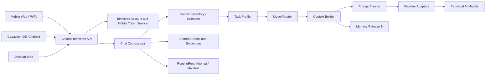

# Tomverse Chat v1 Delivery Plan

- Status: Phase 0 ready
- Planning baseline: 3 engineers
- Target: mobile web first, then locally bundled iOS/Android apps, then desktop web refinement
- Canonical release gates: `docs/release-gates/tomverse-chat-v1.yaml`

This file supersedes all milestone numbers in the earlier v1 through v3.2 prose reviews. In particular, the canonical Prompt Planner beta window is weeks 16–18; the earlier weeks 16–17 estimate is retired.

## 1. Product and platform decision

Tomverse remains a Branded House. Tomverse Chat is a product surface on the shared Tomverse platform, not a separately branded stack or a fork of Tomverse Review.

The following remain shared across Review, Chat, Code, and Studio:

- account and identity linkage;
- projects and conversation ownership;
- model catalog and provider adapters;
- credits, reservation, settlement, reconciliation, and payment history;
- safety, privacy, audit, and data lifecycle services.

Tomverse Chat v1 adds a mobile-first single-answer chat experience whose primary mode automatically selects the best permitted model for the current task. It also adds a versioned Prompt Planner and, only after separate Release B approval, long-term memory.

The existing `ai-chat-hub` repository is the implementation source of truth. The empty `TomverseChat` placeholder repository is archived or made read-only with a redirect to the canonical repository before implementation begins. It must not become a second development root or duplicate platform logic.

## 2. v1 scope

### Included

- ChatGPT-style conversations, streaming, regenerate, stop, edit/resend, attachments, projects, search, and history.
- Auto model routing with visible model choice, reason summary, manual override, and explicit return to Auto.
- Prompt planning with a tested pass-through path and no raw-prompt telemetry.
- Shared Free-tier use that completes inside the app without purchase.
- Server-enforced plan/model limits, guest and Free quotas, abuse controls, and moderation on every dispatch path.
- Responsive mobile web followed by installable PWA support.
- Locally bundled Capacitor apps for iOS and Android; production must not depend on a remote `server.url`.
- System-browser OAuth with PKCE, Sign in with Apple or required equivalent, existing email OTP/magic-link policy, and mobile bearer-token lifecycle.
- In-app account deletion and a unified account export backed by a versioned data-domain registry.
- Shared `chat-core` and `chat-ui` packages so web and native-shell views do not diverge.

### Conditional Release B

- Long-term memory with explicit controls, fail-closed injection, deletion/supersession guarantees, and Korean-first retrieval evaluation.

### Deferred

- In-app purchases. The first store release is consumption-only and uses Free or previously acquired shared credits.
- Push notifications until a concrete user-facing use case is approved.
- A vector database until measured retrieval evidence justifies it.
- A Turborepo migration. npm workspaces are introduced first; a task runner is reconsidered from measured CI/build pain.

## 3. Target architecture



The server owns routing, context limits, provider dispatch, and settlement. Clients own presentation, offline-safe drafts, stream state, cancellation, and native bridges, but cannot bypass server policy.

## 4. Repository and shared UI strategy

Adopt npm workspaces incrementally rather than moving the whole repository in one change:

```text
apps/
  mobile/          Vite + React DOM + Capacitor shell
packages/
  chat-core/       framework-neutral state machines, stream events, retries, cancellation
  chat-ui/         shared React DOM message list, renderer, composer, and chat states
  api-client/      typed web-cookie and mobile-bearer transports
  ui-tokens/       design tokens and ordinary CSS foundations
```

The current Next.js app can remain at the repository root during extraction. Moving it to `apps/web` is a later mechanical migration, not a prerequisite for Router or mobile web delivery.

Before extraction, freeze the existing Review behavior with regression E2E coverage. Keep the headless scope to state machines, streaming, cancellation, retry, and failure recovery; do not attempt to move the entire large composer or all IME/view behavior into core at once.

`packages/chat-core`, `packages/chat-ui`, and `packages/api-client` must be ESM and must not import `next/image`, `next/link`, `next/navigation`, server-only modules, or native bridges. Enforce this with ESLint `no-restricted-imports`, a Next.js/Vite build matrix, and Next.js `transpilePackages`. Platform-specific navigation, image optimization, storage, and deep links are injected through adapters.

## 5. Data evolution

Do not reuse `Conversation.kind` as product identity. Add `productKey` through an expand-and-contract migration:

1. Add nullable/default-compatible columns and new tables without changing existing reads.
2. Dual-write product identity for new and updated records.
3. Dual-read with the legacy behavior as fallback.
4. Backfill in bounded, restartable batches.
5. Verify counts, ownership, export, deletion, billing joins, and Review regressions.
6. Switch reads to `productKey` behind a rollout flag.
7. Enforce constraints only after verification and rollback rehearsal.

Add `RoutingRun`, `RoutingAttempt`, and immutable `ContextManifest` records as defined in `docs/policy/tomverse-chat-routing.md`. The manifest belongs to the attempt because fallback models may receive different context. Store source IDs plus immutable versions/hashes, summary version, inclusion range, truncation points, tokenizer result, Planner/Adapter versions, and effective-request hash; do not duplicate raw prompts.

Use bounded delta manifests with periodic checkpoints and deletion-first retention. Link the final successful attempt to its assistant `Message` so regeneration, model-switch, cost, and quality metrics can be compared by Router version.

## 6. Auto Router and Prompt Planner

Implement Router rollout in this order:

1. Build the versioned task-profile schema and decision-grade evaluation set.
2. Add context inventory and tokenizer-stratified token estimation.
3. Run deterministic rules in shadow mode while the current user-selected path remains authoritative.
4. Add server-side candidate filters for capability, context, attachments, policy, availability, region, health, and credits.
5. Enable a small Auto cohort with sticky selection, confidence margin, and hysteresis.
6. Add the single context-limit escape hatch and candidate-specific fallback preparation.
7. Add model-assisted routing only where measured quality justifies its latency and cost.

The Context Builder runs after initial selection because model limits and tokenizers differ, but a lightweight inventory runs before selection. If the actual build does not fit, it may return to the Router once. Provider fallback follows the per-attempt manifest and execution rules in the routing policy.

The Planner consumes a structured task profile and authorized context, then returns structured instructions/options for the selected provider. Every behavior is versioned. Planner failure does not trigger model fallback; the tested operational downgrade is one same-model pass-through attempt. Adapter failure may trigger a different-model fallback before provider dispatch.

Manual selection persists for the conversation until the user explicitly returns to Auto. A manual selection during temporary fallback recovery clears the recovery candidate immediately.

Production feedback joins manual model switches, regenerate-with-another-model actions, post-regeneration continuation, fallback outcomes, latency, and cost to the originating assistant `Message` and Router version. Provider SLO, routing-reason distribution, estimate error, fallback, and cost-anomaly dashboards are Phase 2/3 deliverables, not a post-launch analytics project.

## 7. Authentication and native app boundary

Keep secure cookie sessions for the web. Add a separate mobile token path rather than assuming cookies from `capacitor://localhost` will behave like the web origin.

The mobile path includes:

- short-lived access tokens and rotating refresh tokens;
- refresh-token family tracking, reuse detection, device listing, logout, and device revoke;
- system-browser OAuth with PKCE and claimed HTTPS universal/app links;
- Sign in with Apple or the store-required equivalent login behavior;
- existing email OTP/magic-link verification through a bearer-token exchange endpoint;
- existing brute-force limits, code expiry, lockout, and Turnstile policy;
- explicit CORS allowlists and hostile-origin tests;
- deep-link ownership and hijacking tests on physical devices.

Engineer C owns the native and client authentication flow. Engineer A jointly implements the token issuance, rotation, reuse-detection, and revoke boundary; this is not a review-only handoff. No production app uses a remote Capacitor `server.url`.

## 8. Memory Release B

Memory does not block the no-memory v1 store candidate. It ships only when the current external conversation/memory policy authorizes Release B and every `MEMORY-*` gate applies successfully.

The first retrieval implementation uses:

- PostgreSQL FTS for supported English tokenization;
- NFC and spacing normalization plus Hangul/CJK bigrams for Korean;
- GIN overlap only as a candidate prefilter;
- intersection-bigram/query-bigram scoring, followed by category, recency, and pin reranking;
- authorization, sensitivity, deletion, and supersession filtering before context construction.

The evaluation set is Korean-first and measures both Recall@5 and incorrect injection. If evidence shows that the lexical contract cannot meet the gates, vector retrieval becomes an explicit follow-up decision rather than a silent scope expansion.

## 9. Billing, privacy, and store policy

Reuse `ChatCreditReservation` and the existing settlement/reconciliation path. Reserve before dispatch, settle actual accepted usage, release on `not_dispatched`, and keep goodwill refunds idempotent. Partial post-token failure never triggers hidden model fallback; preserve the partial response and offer explicit retry.

Maintain a versioned data-domain registry covering conversations, projects, files, memories, routing metadata, credits, linked identities, mobile devices/tokens, and review-related user data. Both account deletion and unified export must use the same registry so a new table cannot silently escape privacy workflows.

The first apps are consumption-only, but a clean new Free account must complete a useful chat. Store credential lifecycle, daily synthetic login, rolling extension, ownership, and alerts are defined in `docs/ops/tomverse-chat-store-review.md`.

Guest and Free access remains useful but bounded. Server-side plan/model allowlists, daily/monthly quotas, concurrency and request-rate limits, attachment/context limits, credit reservation, and content policy checks run for primary, pass-through, and fallback dispatches. Device/IP signals supplement account controls. The release includes adversarial replay and parallel-request tests so Auto routing cannot become a high-cost-model bypass.

## 10. Delivery phases

### Phase 0 — Baseline and decisions (weeks 1–2)

- Commit the canonical gate YAML before creating another threshold table.
- Add a YAML validator and generated Markdown view; fail CI on duplicate IDs, missing required fields, invalid operators, a hand-edited generated file, or an applicable blocking gate that lacks release-mode approval/evidence metadata.
- Freeze Review's critical chat behavior with regression E2E tests.
- Approve Router/Attempt/Manifest, mobile auth, privacy registry, and store credential ADRs.
- Inventory provider/model capabilities, tokenizers, limits, price, regions, and health inputs.
- Produce a versioned Router evaluation set and baseline fixed-model scores.
- Record workspace/package boundaries and framework-purity enforcement.
- Exercise the review synthetic-login alert path and identify primary/backup owners.

Exit: YAML and ADRs are reviewable in the repository, rollback boundaries are explicit, and baseline evidence can be reproduced.

### Phase 1 — Product boundary and shared foundations (weeks 3–4)

- Add `productKey` and routing tables through expand-only migrations.
- Add dual-write/read scaffolding and backfill verification tooling.
- Introduce npm workspaces without relocating the entire Next.js app.
- Establish `chat-core`, `api-client`, `ui-tokens`, and shared event contracts.
- Start responsive mobile layout and Capacitor local-bundle spikes independently.

### Phase 2 — Router shadow, core extraction, and mobile auth (weeks 5–8)

- Implement Estimator, Task Profiler, Router shadow decisions, and RoutingRun telemetry.
- Add provider SLO, routing-reason, estimate-error, fallback, and cost-anomaly dashboards.
- Extract state machines, stream handling, cancellation, and retry behind Review regression tests.
- Co-implement mobile token issuance/exchange, rotation, reuse detection, revoke, and email OTP/magic-link exchange.
- Establish system-browser OAuth/PKCE and verified deep-link contracts.

### Phase 3 — Limited Auto, shared UI, and mobile web (weeks 9–12)

- Enable limited Auto cohorts, attempt-level manifests, billing integration, and pre-token fallback.
- Enforce plan/model, quota, rate-limit, attachment, and moderation policy on every dispatch path.
- Extract shared message list, streaming renderer, composer shell, and fallback status into `chat-ui`.
- Complete the mobile web critical path and clean-device Free flow.
- Continue the locally bundled native shell and physical-device auth integration.
- Start PWA 4A work only if the mobile web and shared UI critical path remains on plan.

### Phase 4 — Mobile web beta and PWA beta (weeks 13–16)

- Mobile web beta: weeks 12–14.
- Complete deferred PWA manifest, service worker, install flow, and offline-safe shell.
- PWA beta: weeks 15–16.
- Harden Router/fallback observability, accessibility, and estimator calibration.
- Complete launch-critical CORS, deep-link, token replay, and device-revoke tests.

### Phase 5 — Planner and native release candidate (weeks 16–22)

- Prompt Planner plus pass-through A/B and operational downgrade drills: weeks 16–18.
- Native shell integration, Apple/equivalent login, account deletion/export, physical-device QA, and review credential checks: weeks 16–22.
- Start Memory Release B only after Router/Planner core work releases Backend/AI capacity.

### Phase 6 — Store release and optional memory (weeks 22–30)

- No-memory public store target: weeks 22–26.
- Memory-inclusive public target: weeks 26–30.
- IAP, if later approved, is a separate 5–8 week track and does not enter the first submission.
- Any later IAP release revalidates current region-specific App Store and Play billing rules at submission time and includes server notifications, receipt validation, refunds, chargebacks, and credit recovery.

External review time and provider-policy changes remain schedule variance, not reasons to weaken a release gate.

## 11. Three-engineer swimlanes

| Window | Engineer A — Backend/AI | Engineer B — Web/UI | Engineer C — Mobile/Release |
| --- | --- | --- | --- |
| W1–2 | Gate/evaluation and routing ADR | Review regression baseline and package RFC | Native/store/auth threat-model input |
| W3–4 | Product/schema expansion | Workspace scaffold and mobile layout | Local-bundle spike and store flow |
| W5–8 | Estimator + Router shadow; jointly implement token server | `chat-core` extraction behind Review E2E | Mobile auth/deep links; jointly implement token client/server boundary |
| W9–12 | Auto cohort, manifests, fallback, billing | `chat-ui` + mobile web critical path; PWA 4A only with spare capacity | Native shell and physical-device auth |
| W13–15 | Router calibration and launch-critical auth support | Mobile web beta, then PWA 4A | Device QA, store compliance, auth attack tests |
| W16–18 | Planner/pass-through, then memory readiness | Shared UI hardening and accessibility | Native integration and review operations |
| W19–22 | Memory Release B or reliability backlog | Cross-surface regression and release support | Native RC and store submission |
| W23–26 | Memory/evaluation and production support | Mobile web/PWA production support | Store review and incident response |
| W27–30 | Memory release/catch-up if included | Release hardening | Review follow-up and rollout |

Authentication server code is jointly owned by A and C. The joint ownership includes design and implementation, not only code review. B is the store-review operational backup so C is not a single point of failure during submission.

## 12. Capacity protection and deferral order

Protect the Router safety boundary and mobile web beta. When a swimlane exceeds capacity, defer work in this order without renegotiating the whole release:

1. Defer PWA 4A from weeks 9–12 to weeks 13–15. Keep `chat-ui` and the mobile web critical path in place.
2. Defer late authentication hardening polish such as secondary dashboards, admin convenience UI, and non-critical performance tuning. Never defer rotation, reuse detection, revoke, Apple/equivalent login, CORS, deep-link, or physical-device attack gates.
3. Defer Memory Release B and ship the no-memory store candidate.
4. Keep push and IAP outside v1.

For Engineer A's weeks 5–8 overload risk, Estimator/Router safety and the token issuance/rotation/revoke boundary take priority over assisted routing and observability polish. For Engineer B's weeks 9–12 overload risk, mobile web beta takes priority over PWA installability.

Any deferral that would violate a canonical blocking gate requires a milestone change; it cannot be treated as an implementation shortcut.

## 13. Release process

- Gate definitions, status, approvers, approval time, and immutable evidence references live in the canonical YAML and are not copied into this plan.
- Every rollout begins in shadow or a bounded cohort with an explicit rollback switch.
- Release evidence is segmented by Router, Estimator, Planner, template, model, provider, client, and app version.
- Phase exit requires primary-owner evidence and an independent reviewer.
- Threshold changes occur through YAML diff review; prose documents may explain decisions but may not redefine numbers.
