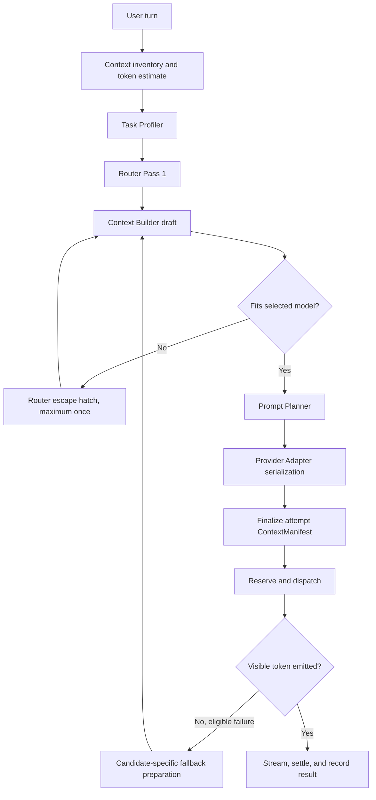

# Tomverse Chat Routing, Planning, and Fallback Policy

- Status: Proposed for Phase 0 implementation
- Decision owner: Backend/AI
- Required reviewers: Product/QA, Security/Privacy, Web/UI, Mobile/Release
- Canonical release thresholds: `docs/release-gates/tomverse-chat-v1.yaml`

## 1. Scope

This policy defines the server-authoritative execution path for Tomverse Chat Auto mode. It covers task profiling, two-pass routing, context construction, prompt planning, provider dispatch, automatic fallback, stickiness, reproducibility, and billing boundaries.

Tomverse Review remains the regression baseline. `Conversation.kind` continues to represent chat/image modality. Product identity is carried by a separate `productKey`; it must not be overloaded into `kind`.

## 2. Non-negotiable invariants

- The server makes and records the final model decision. A client may request Auto or a permitted manual model, but cannot assert an unverified routing result.
- Context is checked against the selected model immediately before dispatch. An over-limit request must never reach a provider.
- Each dispatched `RoutingAttempt` references its own immutable, finalized `ContextManifest`.
- Automatic fallback is allowed only before the first user-visible token and at most once per logical response.
- Existing credit reservation, settlement, reconciliation, and refund infrastructure remains the financial source of truth. Routing does not introduce a second ledger.
- Memory is fail-closed. If authorization, sensitivity filtering, deletion state, or provenance cannot be established, the memory item is not injected.
- Raw effective prompts and memory contents are not copied into routing telemetry. Reproducibility uses IDs, immutable versions, hashes, and bounded manifests.

## 3. Request flow

The context inventory estimates conversation history, attachments, project instructions, summaries, and eligible memory without first building the full provider request. The estimate and task profile drive Pass 1. The Context Builder then applies the selected model's tokenizer, budget, summary, and truncation rules.

If the built request exceeds the selected model's limit, the Router may take one escape-hatch pass. It must select a compatible model or fail without dispatch. A second context-limit reroute is prohibited.

Question-type changes do not immediately break Auto stickiness. A soft switch requires a configured confidence margin plus hysteresis across consecutive turns. Exact values are versioned Router configuration, not client behavior.

## 4. Execution budgets

For one logical assistant response:

- Full Context Builder executions: maximum two.
- Context-limit reroutes: maximum one.
- Automatic provider fallback: maximum one after the primary dispatched attempt.
- Dispatched provider attempts: maximum two total, comprising the primary and one fallback.
- Planner pass-through downgrade: maximum one per logical response, only before the affected attempt is dispatched, and only while no user-visible token has been emitted.

Reusing an already-built context for a tokenizer-compatible candidate does not consume another full Context Builder execution, but the candidate still requires its own actual-token check and finalized manifest. If the remaining budget cannot safely prepare a fallback candidate, execution stops without fallback.

Fallback candidates are filtered during Pass 1. A candidate is eligible only when the current context can be safely reused or a candidate-specific rebuild remains within the execution budget. Health, policy, regional availability, capability, context limit, attachment support, and credit constraints are all hard filters.

## 5. RoutingRun, RoutingAttempt, and ContextManifest

`RoutingRun` represents one logical assistant response. It records at least:

- input user `Message` ID and final assistant `Message` ID, if produced;
- Router, Task Profiler, Estimator, Planner, template, and policy versions;
- estimated tokens, selected-model actual tokens, and estimate error;
- initial model, final successful model, selection reasons, confidence, and switch reason;
- routing-decision latency, first-token time, reroute count, and fallback state;
- billing reservation ID and terminal settlement outcome.

`RoutingAttempt` represents one preparation/dispatch attempt and records at least:

- attempt index, candidate model/provider, tokenizer version, and manifest ID;
- `plannerMode` (`planned` or `pass_through`);
- `outcome` (`not_dispatched`, `failed_pre_token`, `failed_post_token`, `cancelled`, or `succeeded`);
- `failureLayer` (`planner`, `adapter`, `manifest`, `billing`, `provider`, `stream`, or `none`);
- dispatch time, provider request ID when available, first visible token time, actual usage, and error class.

A `not_dispatched` attempt is retained for reliability analysis but does not count as a provider attempt and cannot be billed as provider usage.

### Manifest lifecycle

1. The Context Builder creates a draft manifest containing authorized source references, immutable versions/hashes, summary version, inclusion range, truncation points, tokenizer, and actual token counts.
2. The Planner produces a structured plan or pass-through decision.
3. The Provider Adapter produces the effective provider request.
4. Immediately before dispatch, the system adds Planner/template versions, structured option hashes, adapter version, and the final effective-request hash, then atomically marks the manifest `finalized`.
5. Dispatch is prohibited unless manifest finalization and the attempt reference both succeed.

If preparation fails, the draft is marked `not_dispatched` with a reason. It must not be misrepresented as the request that reached a provider. A fallback or pass-through downgrade creates a new attempt and its own manifest lifecycle.

Manifest storage uses periodic full checkpoints with bounded deltas between them. Delta depth is capped by `MANIFEST-01`. Detailed manifests are compacted after the retention period in `MANIFEST-02`; user deletion and memory deletion/supersession always take priority over audit retention.

## 6. `not_dispatched` failure policy

### Planner failure

A Planner failure is treated as a common-layer failure, not a model failure. It does not trigger model fallback.

The operational setting `plannerFailureMode` has two allowed values:

- `fail_closed`: show a retryable error and release the reservation without dispatch.
- `pass_through_once`: mark the failed preparation `not_dispatched`, reuse the authorized built context, create one new attempt with `plannerMode=pass_through`, and run Adapter/finalization/dispatch once for the same selected model.

The downgrade is allowed only before the affected attempt is dispatched, is recorded on `RoutingRun`, and may occur once per logical response. A prior pre-token provider dispatch on another attempt does not disqualify the downgrade. Therefore, if the primary provider fails before visible output and the fallback candidate's Planner then fails, that fallback candidate may use the remaining pass-through downgrade once; it does not trigger selection of a third model. The pass-through path must pass the same authorization, context-limit, adapter, manifest, and billing checks as planned execution. If it fails, the request terminates. The operational switch is enabled only after pass-through evaluation and rollback drills are complete.

### Adapter failure

An Adapter failure is assumed to be model/provider-specific. It is marked `not_dispatched`, releases any unused reservation, and is eligible for a different-model fallback. Because no provider received the request, it does not consume a dispatched-attempt slot. It does consume any Context Builder work already performed.

The fallback candidate must pass the normal compatibility filters and must have its own draft, adapter serialization, actual-token check, and finalized manifest. If the two-build budget is exhausted and the existing context cannot safely be reused, fallback is not attempted.

### Manifest, authorization, and billing-preparation failures

These are infrastructure or safety-boundary failures. They fail closed and do not trigger model fallback. Provider dispatch is prohibited, the reservation is released or reconciled, and an operational incident is emitted.

## 7. Provider fallback and billing

Automatic fallback is eligible only when the primary provider attempt fails before any user-visible token. Cancellation, policy rejection, insufficient credits, client disconnect, and post-token stream failure are not automatic fallback candidates.

During fallback, the client receives a non-terminal `retrying_with_another_model` state. The composer remains protected from duplicate submission, cancellation remains available, and accessibility text announces the retry without exposing internal provider errors.

After a visible token, the partial response is preserved and no automatic model switch occurs. The user receives explicit retry/regenerate controls.

Settlement uses actual accepted provider usage. A configured early-failure goodwill threshold may refund the full user charge when failure happens within the first bounded number of tokens, but the rule must be idempotent and must not rewrite provider cost accounting.

## 8. Stickiness and recovery

Auto mode normally keeps the successful model to avoid turn-to-turn model ping-pong. A successful automatic fallback updates the sticky model to `finalSuccessfulModelId` and records:

- `switchReason=temporary_hard_fallback`;
- the previous model as `recoveryCandidateModelId`;
- the provider-health evidence that caused the fallback.

On the next Pass 1, the Router may restore `recoveryCandidateModelId` without satisfying soft-switch hysteresis only when the original hard-failure condition is confirmed healthy and all current capability/context/policy filters pass. Other hard-switch reasons do not receive this automatic restoration rule.

If the user manually selects a model while `temporary_hard_fallback` recovery is pending, the system immediately clears `recoveryCandidateModelId` and all automatic recovery metadata. The conversation enters `manual` mode and remains there until the user explicitly selects Auto. Manual intent always wins over fallback recovery.

## 9. Memory retrieval contract

Memory Release B remains separately gated. The initial retrieval contract is:

- Memory, attachments, imports, tool output, and retrieved project content are untrusted data, never higher-priority instructions.
- The Context Builder serializes each trust domain in a provider-appropriate isolated role or escaped structured block. It preserves source/provenance and never concatenates retrieved text into the system instruction.
- The Planner may summarize or select untrusted content but may not promote it across the instruction-precedence boundary. Apparent instructions inside retrieved content remain quoted data.
- English candidates may use configured PostgreSQL FTS.
- Korean text uses NFC normalization, spacing normalization, and Hangul/CJK bigrams stored in a GIN-indexed term array.
- GIN overlap is only a candidate prefilter. Ranking uses intersecting query bigrams divided by query bigram count, followed by category, recency, and pinned-memory adjustments.
- Authorization, sensitivity, deletion, and supersession filters run before any item reaches the Context Builder.
- Vector retrieval is reconsidered only from measured Korean recall and precision evidence, not by assumption.

## 10. Safety and abuse boundary

Routing cannot be used to escape account entitlements. Plan/model allowlists, guest and Free quotas, concurrency/rate limits, attachment limits, moderation requirements, and credit availability are checked on the server before every dispatch, including fallback and Planner pass-through.

A fallback cannot silently upgrade a user to a model or capability that the original request was not allowed to use. Device, account, and IP signals may reduce an abuse limit but do not replace account authorization. Telemetry records policy result and reason codes without retaining raw prompt content.

Online Router evaluation links final assistant messages, manual model changes, regenerate-with-another-model actions, post-regeneration conversation continuation, fallback outcomes, cost, and provider SLOs to Router/Planner versions. Dashboards expose routing-reason distribution and cost anomalies; product metrics never become an authorization input without a separately reviewed policy.

## 11. Release evidence

The generated release-gate view must link routing results to the IDs under `ROUTE-*`, `ESTIMATE-*`, `FALLBACK-*`, `PLANNER-*`, `BILLING-*`, `ABUSE-*`, `MODERATION-*`, `MEMORY-*`, and `MANIFEST-*` in the canonical YAML. This policy intentionally does not duplicate their numeric thresholds.
